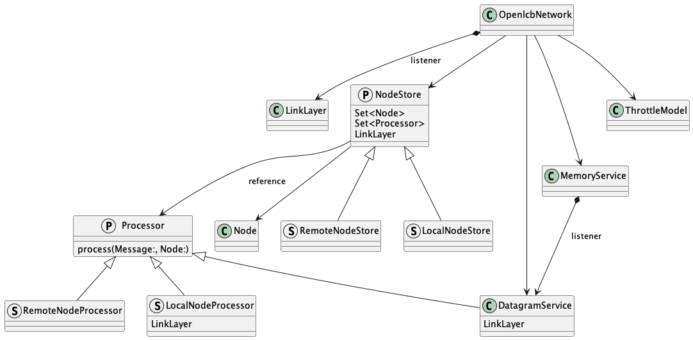
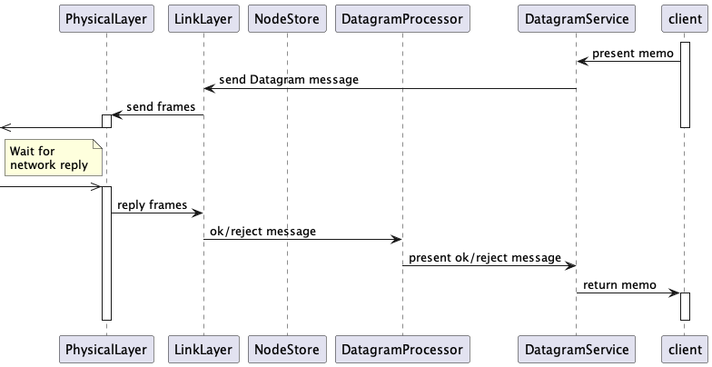

# ``OpenlcbLibrary``

An implementation of the OpenLCB protocols in library form.

## Overview

In addition to protocol message parsing, provides
 - Physical layer connection(s)
 - High-level services for Datagram and Memory protocols

At the message level:
 - Processors are created with a reference to a specific NodeStore, typically a "local" or "remote" one
 - The LinkLevel implementation provides a listener interface.  All the Processors are registered with this.
 - User interactions are through (to and from) a specific Node. It works with the LinkLevel (for raw messages) and through Datagram and Memory services.

 Typical Processors
 - PrintingProcessor: converts received messages to Strings for display and or logging
 - RemoteNodeProcessor: keeps track of remote nodes and provides access to their internal information

 Nodes, Stores, and Link-level and Phy-level implementations are permanent: Once they are created, they persist until the end of the program.  Therefore ARC loops are permitted. Messages, Events, and the various ID structs are immutable and not permanent. Processors are in-between: They are immutable once created, but long-lasting hence are allowed to have references to other objects.

The ``OpenlcbLibrary`` can be used to build a complete configuration.

Processing of a frame from the physical level into a message, which then updates the node(s):

Processing of a Datagram send and reply:

Processing of a Datagram receipt and reply with delayed return:

Overlaps in processing of Datagram receipt with immediate return:

